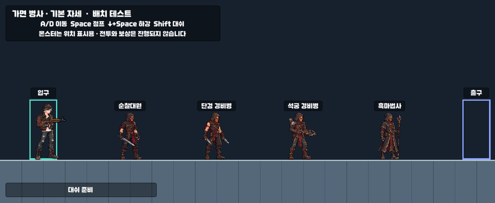

# 가면 인간형 몬스터 · 정지 자세

사용자가 제공한 엘소드 엘더 잡몹 이미지를 가면·후드의 참고로, 승인된 MiniWar 남녀 캐릭터를 도트 화풍과 신체 비율의 참고로 사용했다. 내장 `image_gen`으로 각 몬스터를 개별 생성했다. 아래에서 몸과 팔을 분리하거나 별도 애니메이션을 만들지 않는다.

| 종류 | 모습 | 프로젝트 이미지 |
| --- | --- | --- |
| 순찰대원 | 구리 가면, 후드, 가죽 조끼, 짧은 검 | `Assets/Art/Monsters/MaskedV1/PatrolIdleV1.png` |
| 단검 경비병 | 같은 계열의 가면, 민소매 조끼, 쌍단검 | `Assets/Art/Monsters/MaskedV1/DaggerGuardIdleV2.png` |
| 석궁 경비병 | 공통 구리 가면·후드, 어깨 방어구, 목재 석궁 | `Assets/Art/Monsters/MaskedV1/CrossbowGuardIdleV2.png` |
| 흑마법사 | 공통 구리 가면, 긴 로브, 보라색 수정 지팡이 | `Assets/Art/Monsters/MaskedV1/DarkMageIdleV2.png` |

단검병 초안의 가면이 작다는 피드백을 반영해, 얼굴 전체를 덮도록 가면을 확대하고 순찰대원의 머리 대비 가면 비율에 맞춘 V2를 사용한다. 수정 전 그림은 `DaggerMaskBefore.png`에 남겼다.

추가 결정: 가면의 외곽, 좁은 눈구멍, 중앙 코 능선, 각진 볼과 턱은 순찰대원의 공통 모델에 맞춘다. 병과는 무기와 복장으로 구분하고 **지위는 가면 색과 문양으로 구분한다.** 현재 4종은 일반병이므로 같은 구리색에 별도 계급 문양 없이 통일한다. 정예·지휘관은 이후 같은 형태에 색과 문양을 더하는 방식으로 제작한다. 해당 계급 변형 이미지는 아직 생성하지 않았다. 흑마법사 초안의 옅은 금색 가면도 공통 구리 가면으로 수정한다.

원본 PNG의 픽셀과 알파를 보존한다. Unity에서 투명 여백을 제외한 Sprite 영역만 지정하며 Point 필터, 압축 없음, 발밑 피벗을 사용한다. 인간형 높이는 2.2m이고, 이미지 가로세로 비율을 유지해 그린다. 배치용 몸체 폭과 무기가 포함된 그림 폭은 별도로 다룬다.

`EnemyData.idleSprite`에 기본 모습을 연결하고, 배치별 `DungeonSpawn.sprite`가 지정되어 있으면 우선한다. 기존 순찰대원과 석궁병 배치에는 기본 그림이 자동 적용된다. 단검병과 흑마법사는 몬스터 배치 도구에서 선택한다. 사각형은 그림이 없는 몬스터의 임시 표시로만 남는다.

Unity `MiniWar → Monsters → Masked idle preview`에서 4종을 함께 확인한다. `Register masked idle sprites`는 가져오기 설정과 EnemyData 연결을 다시 적용한다. 갤러리는 `Assets/Data/DungeonLayouts/MaskedEnemyIdleGallery.asset`에 저장한다. 현재 작업은 정지 그림과 배치 표시까지이며 이동·공격 모션이나 전투 AI는 포함하지 않는다.

2026-09-30 확인: 최종 PNG 4장 모두 실제 투명 알파를 포함한다. Unity에서 원본 픽셀을 바꾸지 않고 영역과 피벗을 지정했다. 실제 Play 화면에서 4종의 가로·세로 배율이 같고 발이 바닥에 닿는 것을 확인했다. 기존 배치/이동 47개와 복층 33개, 총 80개 검사 통과.

생성 프롬프트: [Prompts.json](Prompts.json). 단검병 수정 프롬프트: [DaggerMaskCorrection.txt](DaggerMaskCorrection.txt). 공통 가면 수정 프롬프트: [CommonMaskCorrections.json](CommonMaskCorrections.json). 사용자 참고 원본: [MaskedHumanoidReference.png](MaskedHumanoidReference.png). 최초 프롬프트의 병과별 가면 차이는 위 공통 가면 결정으로 대체한다.
