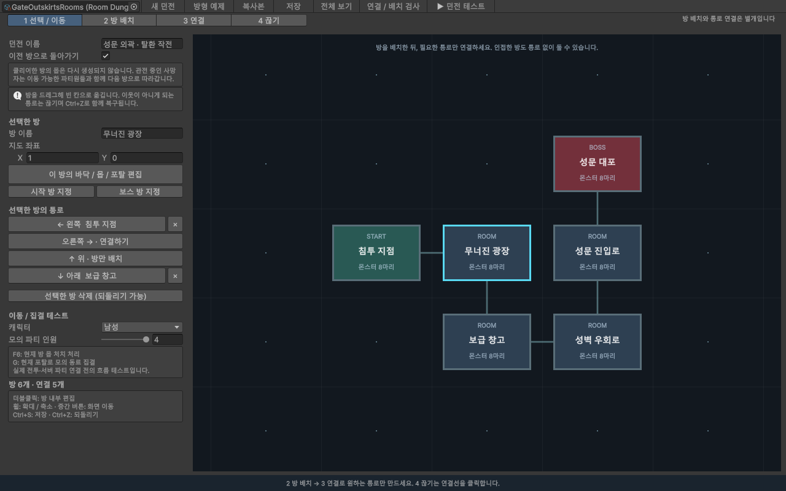
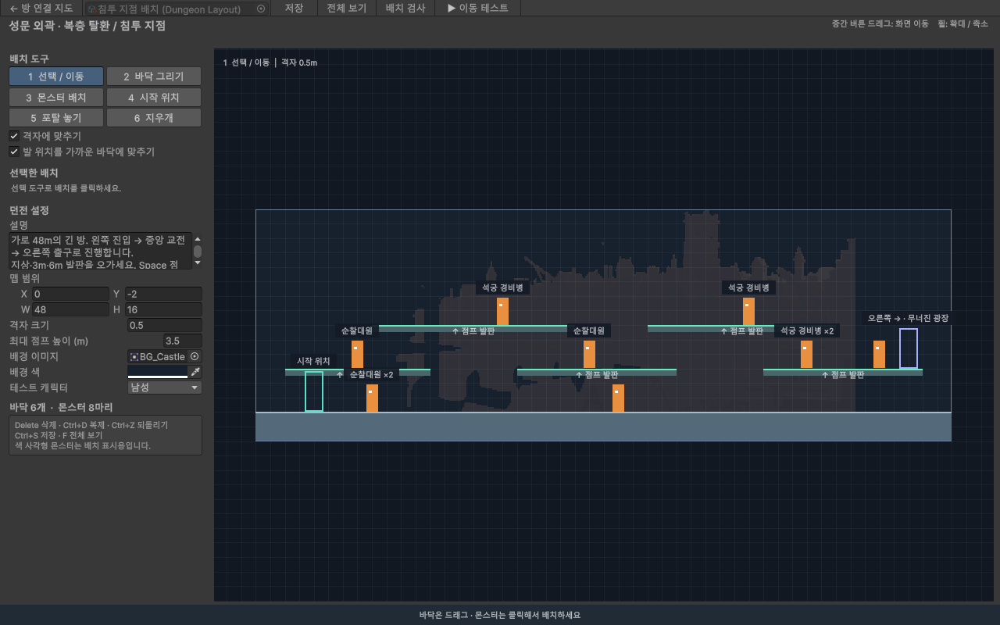

# 방 클리어형 던전 제작기

Unity 메뉴 **MiniWar → 던전 제작기**를 연다. 한 던전은 여러 방과 방향별 포탈로 구성된다. **방 연결 지도**에서 동선을 만들고, 방을 더블클릭해 **방 내부 배치**에서 바닥·몬스터·포탈 위치를 정한다.

**복층 맵으로 시작하려면 상단의 `복층 예제`를 누른다.** 같은 6개 방 연결에 지상·중간·상단의 3층 발판을 넣은 별도 예제다. 기존 방 연결 예제의 내부 배치는 보존한다.

## 방 연결 만들기

1. **방형 예제**를 누르면 성문 외곽의 6개 방을 연다. 침투 지점 → 무너진 광장 → 보급 창고 → 성벽 우회로 → 성문 진입로 → 성문 대포 순서다. 광장과 진입로는 나란히 있지만 직접 연결되지 않는다.
2. **2 방 배치:** 빈 격자 칸을 클릭해 방만 만든다. 인접한 방과 자동으로 연결되지 않는다. 새 방에는 기본 몬스터 8마리가 들어간다.
3. **3 연결:** 상하좌우로 바로 이웃한 방 두 개를 차례로 클릭하면 왕복 통로가 생긴다.
4. **4 끊기:** 연결선을 클릭하거나 연결된 방 두 개를 차례로 클릭하면 통로만 끊는다. 방과 내부 배치는 남는다. 왼쪽 연결 목록의 `×`도 같은 기능이다.
5. **1 선택/이동:** 방을 드래그해 빈 격자 칸으로 옮긴다. 왼쪽 **지도 좌표**로도 이동할 수 있다. 더 이상 이웃하지 않는 방과의 통로는 함께 끊기며, `Ctrl+Z` 한 번으로 위치와 통로를 복구한다. 여전히 이웃한 방과의 통로는 유지되고 방향만 바뀐다. 내부에 직접 배치한 포탈·도착 좌표는 유지되므로 필요하면 방 내부 편집에서 조정한다.
6. **시작 방 지정 / 보스 방 지정**으로 역할을 정한다. 보스 방은 하나다. 방 이름 변경·추가·연결·끊기·이동·삭제는 되돌릴 수 있다. 방을 삭제해도 Undo를 위해 내부 배치 하위 에셋은 보관한다.
7. **새 던전**은 서로 연결하지 않은 시작 방과 보스 방으로 시작한다. **복사본**은 모든 방의 내부 배치까지 독립적으로 복사한다. 예제를 다시 열어도 편집 내용은 초기화되지 않는다.

격자 위치는 방의 연결 방향을 뜻하며 통로는 직접 연결했을 때만 생긴다. 각 방의 실제 가로 길이나 발판 높이는 그 방 안에서 별도로 정한다. 휠로 확대/축소하고 중간 버튼을 끌어 지도를 이동한다. `1~4` 도구 전환, `Esc` 연결 선택·드래그 취소, `F` 전체 보기, `Ctrl+S` 저장이다.

연결하지 않은 일반 방은 **미연결 보관**으로 표시되며 저장·편집할 수 있다. 현재 플레이 경로에서는 방문하지 않는다. 보스 방은 시작 방에서 도달할 수 있어야 던전 테스트를 시작할 수 있다.

예제의 모든 방은 8마리다. 일반 방은 순찰대원 8마리 또는 순찰대원 4마리 + 석궁 경비병 4마리, 보스 방은 대포 1마리 + 호위 순찰대원 7마리다. 방 내부 편집에서 수를 더 늘릴 수 있으며, 8마리 미만은 배치 검사에서 알려준다.

## 점프로 오르내리는 복층 방

방 연결 지도와 방 내부 높이는 독립적이다. 지도에서 오른쪽 방으로 가는 포탈도 위층에 놓을 수 있으며, 플레이어는 방 안의 발판을 오가며 전투한 뒤 해당 포탈에 모인다.

- **단단한 바닥 / 벽:** 아래·위·옆에서 모두 막힌다. 지상과 외벽에 사용한다.
- **아래에서 통과하는 발판:** 점프 상승 중에는 통과하고, 내려올 때 윗면에 착지한다. `↓+Space` 또는 `S+Space`로 현재 발판을 내려간다. 아래층 발판에서는 다시 착지한다.
- **예제 비율:** 각 방을 가로 24m에서 **48m**로 확장했다. 지상 0m, 중간 3m, 상단 6m의 높이는 유지한다. 발판 두께 0.5m, 최대 점프 높이 3.5m다. 실제 고정 프레임 이동의 최고점은 약 3.37m이므로, 층 간격은 3m부터 시작한다. 최대 점프 높이는 각 방의 설정에서 조정한다.
- **긴 방의 동선:** 왼쪽 진입 구간 → 중앙 교전 구간 → 오른쪽 출구 구간에 몹 8마리를 분산했다. 중간 발판 3개와 상단 발판 2개가 엇갈려 있어 오른쪽으로 진행하면서 오르내린다. 오른쪽 포탈은 맵 끝의 위층으로 옮겼다. 보스 방은 오른쪽에 넓은 지상 전투 공간을 둔다.

48m 확장 후 복층 검사 33개를 다시 통과했다. 실제 Play 모드에서 입구부터 오른쪽 포탈까지 점프·하강을 이어 이동할 수 있고, 카메라가 좌우로 스크롤하는 것을 확인했다.
- **몬스터:** 방당 8마리를 세 층에 분산했다. 보스 방은 넓은 지상의 대포 1마리와 지상·왼쪽 발판의 호위 7마리다. 현재는 배치 표시이며 AI가 층을 이동하는 기능은 후속 작업이다.
- **카메라:** 캐릭터를 가로·세로로 따라가되 맵 경계 안에 머문다. 방을 바꿀 때는 도착 위치로 즉시 맞춘다.

발판은 가로로 일부 겹치게 엇갈려 놓으면 위로 점프하기 쉽다. 모든 층을 긴 바닥 하나로 채우기보다 전투 구역과 오르내릴 공간을 나눠 만든다. 첫 방은 2~3층으로 점프를 익히게 하고, 보스 방은 회피할 넓은 지상을 우선한다.

이 점프 설정과 하강 조작은 던전 제작기의 로컬 미리보기에 적용된다. 온라인 마을의 점프와 서버 이동 규칙은 기존과 같으며, 실제 온라인 던전 연결 시 서버에도 같은 지형·발판 충돌 규칙을 적용해야 한다.

## 방 내부 배치

방을 더블클릭하거나 **이 방의 바닥 / 몹 / 포탈 편집**을 누른다.

- **1 선택 / 이동:** 배치를 클릭하고 드래그한다. 바닥 오른쪽 아래 모서리는 크기 조절이다. 정확한 좌표는 왼쪽에서 입력한다.
- **2 바닥 그리기:** `지형 종류`에서 단단한 지형 또는 아래에서 통과하는 발판을 고르고 드래그한다. 이미 배치한 바닥도 선택 후 `아래에서 통과하는 발판`을 켜거나 끌 수 있다. 스프라이트와 색을 지정할 수 있다. 초록색 윗선이 점프 발판이다.
- **3 몬스터 배치:** 종류를 선택하고 클릭한다. 선택 후 수량·간격으로 묶음을 배치한다. 순찰대원·단검 경비병·석궁 경비병·흑마법사는 기본 가면 도트가 연결되어 있다. 배치별 이미지가 있으면 우선 사용하고, 없으면 EnemyData의 기본 정지 그림을 사용한다. 그림은 비율을 유지하며 발밑에 맞춘다. 기본 그림도 없으면 일반 몹은 주황색, 보스는 붉은색 표시가 된다. [그림과 프롬프트](Art/MonsterIdleV1/README.md).
- **4 시작 위치:** 이 방에서 단독 테스트를 시작할 발 위치다. 다른 방에서 들어올 때의 위치는 각 포탈의 도착 위치를 사용한다.
- **5 포탈 놓기:** 연결된 방향을 선택하고 클릭한다. 포탈을 선택하면 **포탈 발 위치**와 **들어온 뒤 도착 위치**를 조절할 수 있다. 분홍색 점을 끌어 도착 위치를 옮길 수 있다.
- **6 지우개:** 바닥과 몬스터를 삭제한다. 포탈 연결 자체의 삭제는 방 연결 지도에서 한다.

위/아래 포탈은 미니맵의 위/아래 방으로 가는 문이다. 횡스크롤 화면에서는 캐릭터가 걸어 들어갈 수 있는 바닥 위 출입구로 배치한다. 반드시 화면 꼭대기나 바닥 아래에 둘 필요는 없다.

기본 격자는 0.5m다. **발 위치를 가까운 바닥에 맞추기**를 켜면 몬스터와 포탈이 가까운 바닥 위에 놓인다. 도착 위치는 모든 포탈 진입 영역 밖에 두어 왕복 이동이 즉시 반복되지 않게 한다.

`Delete` 삭제, `Ctrl+D` 바닥/몬스터 복제, `Ctrl+Z / Ctrl+Y` 되돌리기/다시 실행, `Ctrl+S` 저장, `F` 방 전체 보기. **← 방 연결 지도**로 던전 전체 편집에 돌아간다.

## 방 진행 규칙

1. 방에 몬스터가 남아 있으면 모든 포탈이 잠긴다. 방의 몬스터를 전부 처치하면 포탈이 열린다.
2. 이동 가능한 파티원 전원이 **같은 포탈**에 들어오면 파티 전체가 연결된 방의 도착 위치로 함께 이동한다. 한 명이 남았거나 서로 다른 포탈에 나눠 서 있으면 기다린다.
3. 관전 중인 사망자는 집결 대상에서 제외하고 함께 이동한다. 전원 사망한 파티는 진행할 수 없다. 접속이 끊긴 인원을 임의로 제외해서 통과시키지는 않는다.
4. 이전 방으로 돌아갈 수 있으며, 처치 상태를 던전 진행 중 계속 보관한다. 이미 클리어한 방에는 몹이 다시 나오지 않는다. 새 던전 실행을 시작하면 초기화된다.
5. 보스 방을 클리어하면 던전 완료로 표시한다.

## 모의 파티 테스트

방 연결 지도에서 캐릭터와 **모의 파티 인원 1~4명**을 선택하고 **던전 테스트**를 누른다. 방 내부 창의 이동 테스트는 선택한 방부터 혼자 시작한다.

- `A / D` 또는 좌우 화살표: 이동
- `Space`: 점프
- `↓+Space` 또는 `S+Space`: 발판에서 아래로 내려가기 (단단한 지상에서는 내려가지 않음)
- `Shift`: 1초 안에 최대 2연속 대쉬, 마지막 사용부터 3초 쿨타임
- `R`: 현재 방 시작 위치로 복귀
- **F6:** 현재 방의 몬스터를 전부 처치한 것으로 처리하는 테스트 버튼
- **G:** 캐릭터가 들어간 포탈로 모의 동료를 모으는 테스트 버튼

예를 들어 4인 테스트에서 F6을 누르고 포탈로 걸어가면 `집결 1 / 4`로 대기한다. G를 누르면 동료가 합류하고 다음 방으로 이동한다. 미니맵은 현재 방·클리어한 방·시작 방·보스 방을 표시한다.

이것은 **방 연결과 집결 규칙을 검증하는 로컬 테스트**다. 실제 몬스터 AI·사격 전투·서버 파티 입장·보상은 아직 연결하지 않았다. 파란 표시는 모의 동료이며 다른 PC의 실제 플레이어가 아니다. 서버나 로그인 없이 사용할 수 있다.

Play를 종료하면 기존 편집 장면과 이전 Play 시작 장면 설정으로 돌아간다. 테스트용 `Assets/Scenes/Tools/DungeonPlaytest.unity`는 Windows 게임 빌드의 시작 장면을 바꾸지 않는다.

## 저장과 검사

- `Assets/Data/RoomDungeons/GateOutskirtsRooms.asset`: 새 방형 던전 예제. 방별 배치는 같은 파일의 하위 에셋에 함께 저장된다.
- `Assets/Data/RoomDungeons/GateOutskirtsPlatforms.asset`: 같은 방 연결에 3층 점프 발판을 넣은 예제. 첫 생성 후 다시 열어도 편집 내용을 초기화하지 않는다.
- `RoomDungeon`: 시작 방, 방 목록, 미니맵 좌표, 왕복 포탈 연결과 도착 위치.
- `DungeonLayout`: 각 방의 바닥, 몬스터, 배경, 시작 위치.
- `DungeonRoomRun`: 실행 중 방별 처치 상태, 전원 집결 판정, 재입장·완료 상태. 온라인 연결 시에는 서버가 관리하는 파티원 명단·위치·사망 상태를 전달해야 한다.

**연결 / 배치 검사**는 끊어진 왕복 연결, 도달할 수 없는 보스 방, 겹친 지도 위치, 잘못된 보스 방 수, 방당 몬스터 8마리 미만, 겹친 포탈, 포탈 내부 도착 위치, 바닥 없는 배치를 검사한다. 도달할 수 없는 일반 방은 보관 안내만 표시하며 테스트를 막지 않는다. 실제 점프 동선은 이동 테스트로 추가 확인한다.

`MiniWar → Tests → Multilevel dungeon checks`는 복층 점프·하강·벽/천장 충돌·발판 편집과 저장을 검사한다. `Room placement and links`는 실제 편집기 클릭·드래그로 배치·연결·끊기·Undo/Redo·저장 후 재로드를 검사한다. `Room dungeon checks`는 파티 집결·처치 상태 유지·우회 경로·Undo·포탈 드래그를, `Dungeon builder checks`는 기존 바닥/몹 편집·이동을 검사한다.

기존 일자형 예제 `Assets/Data/DungeonLayouts/GateOutskirts.asset`는 보존했다. 새 복층 던전 작업은 `복층 예제`에서 시작하면 된다.

2026-09-30 검증: 복층 이동/편집 33개 + 방 지도 조작 28개 + 방형 던전 51개 + 기존 배치/이동 47개, 총 159개 검사 통과. 실제 Play 모드에서 두 번의 점프로 3층 도착, 중간층 하강, 위층 포탈 이동·복귀와 처치 상태 유지도 확인했다. 기존 1/4 집결 대기와 전원 동시 이동 규칙도 유지된다. 16:59 Windows 클라이언트 빌드 `Succeeded errors=0`. 온라인 마을 장면과 기본 Play 시작 설정은 유지된다.
