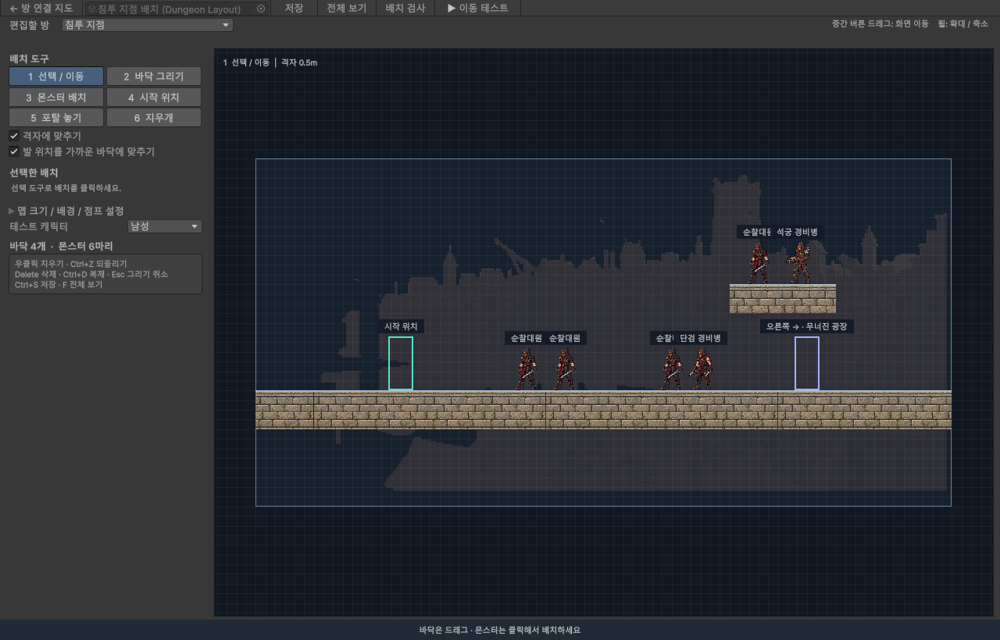
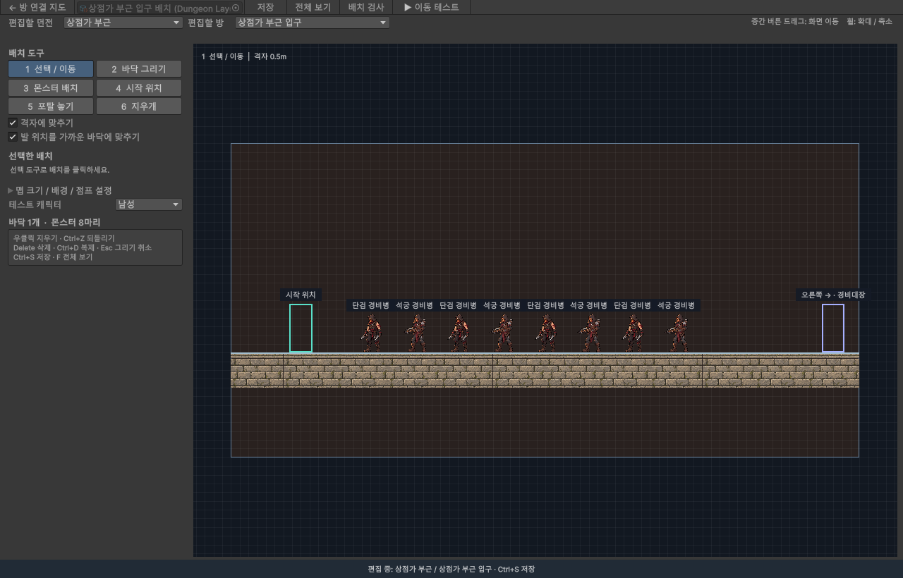
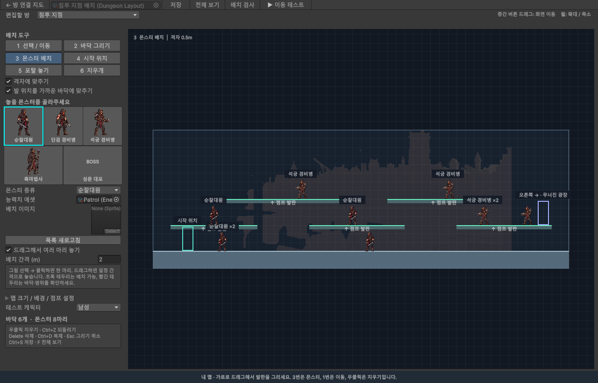

# 방 클리어형 던전 제작기

2026-10-01: 성문 외곽 6개 방을 **24×12 → 36×18**로 확장했다. 중심을 유지해 범위는 `(-6,-6,36,18)`이며, 기존 발판·몬스터·시작 위치·포탈 좌표와 방 연결은 보존했다. 양옆에 6m씩 기본 바닥만 추가했다. 이전 배치는 `Logs/QA/PortalExpansion/GateOutskirtsRooms-before.asset`에 백업했다. 원본 위치·내용 92개 비교 통과.

기본 바닥은 **포장석 윗면 + 벽돌 단면** 두 스프라이트로 표시한다. 폭과 높이가 달라도 돌 크기를 유지하며 반복하고, 편집기·로컬 테스트·온라인에서 같은 재질을 사용한다. [아트와 생성 프롬프트](DUNGEON_TERRAIN_ART.md).

## 바로 맵 그리기

Unity 메뉴 **MiniWar → 맵 배치 그리기**를 연다. 상단 **편집할 던전**에서 성문 외곽·상점가 부근·왕궁 진입로·지하 신전·마족 레이드를 고른다. 그 옆 **편집할 방**에서 해당 던전의 방을 고른다. 같은 던전 선택창이 **MiniWar → 던전 제작기**의 방 연결 지도에도 있다.

던전을 전환하면 이전 던전의 수정사항을 저장한다. 다시 열 때 마지막으로 선택한 던전을 불러온다. 기존 `MyDungeon.asset`과 복사본도 목록에서 선택할 수 있다. 성문 외곽은 완성한 원본 배치를 그대로 사용하며, 나머지 던전은 독립된 파일로 저장된다.

| 던전 | 저장 파일 (`Assets/Data/RoomDungeons/`) |
| --- | --- |
| 성문 외곽 | `GateOutskirtsRooms.asset` |
| 상점가 부근 | `MarketRooms.asset` |
| 왕궁 진입로 | `PalaceApproachRooms.asset` |
| 지하 신전 | `UndergroundTempleRooms.asset` |
| 마족 레이드 | `DemonRaidRooms.asset` |

새 던전은 36×18 크기의 시작 방과 보스 방을 연결한 뼈대로 시작한다. 기본적으로 일반 방은 8마리, 보스 방은 보스 위치 표시 1개와 일반 몹 7마리다. 보스 그림과 동작은 임시 상태다. 새로 추가하는 방은 같은 던전의 크기·점프 설정·배경·일반 몬스터 종류를 이어받으며 배치는 독립적이다. 레이드 제작기는 최대 6명의 모의 파티로 이동을 시험할 수 있다. 이 네 던전의 온라인 입장은 아직 활성화하지 않았다.

2026-10-01 선택 기능 검증: 다섯 던전 열기·신규 뼈대 검사 17항목, 별도 복사본의 몬스터 수정/방 추가 후 전환·자동 저장·재로드, 마지막 선택 기억, 방 데이터 독립성 통과. 실제 DungeonSandbox의 6인 생성과 4명 과반수 이동도 확인했다. 기존 성문 외곽과 MyDungeon을 포함한 원본 여섯 파일은 검사 전후 동일했다 (`Logs/QA/CampaignSelector/Result.txt`).

1. **2 바닥 그리기 → 점프 발판:** 원하는 윗면 높이에서 좌우로 드래그한다. 시작한 높이에 두께 0.5m의 발판이 생긴다. 세로로 흔들려도 높이는 유지한다. **바닥 / 벽**을 고르면 사각형 영역을 드래그해 단단한 지형을 만든다. 새 바닥은 맵 범위 안으로 잘린다.
2. **3 몬스터 배치:** 순찰대원·단검병·석궁병·흑마법사·대포 그림을 고르고 클릭한다. 드래그하면 기본 2m 간격으로 여러 마리를 놓는다. 간격은 왼쪽에서 조절하며, 드래그 배치를 끄면 클릭한 곳에만 한 마리를 놓는다. 커서의 그림은 배치 미리보기다. 초록 테두리는 지지 바닥과 공간이 있고, 빨간 테두리는 바닥·벽 겹침·맵 범위를 확인해야 한다는 뜻이다. 맵 밖 배치는 막으며, 바닥 없는 위치는 경고와 함께 배치할 수 있다.
3. **1 선택 / 이동:** 놓은 몬스터나 바닥을 드래그한다. 바닥의 오른쪽 아래 손잡이를 끌면 크기가 바뀐다.
4. **우클릭 또는 6 지우개:** 몬스터는 클릭한 한 마리만, 바닥은 클릭한 한 개를 지운다. 드래그하면 지나간 배치를 연속해서 지운다. 입구·출구·포탈은 지워지지 않는다.
5. **Ctrl+Z:** 이번 드래그를 한 번에 되돌린다. **Esc:** 누르고 있는 그리기·이동·지우기를 취소한다. **Ctrl+S:** 에셋에 저장한다.
6. 상단 **편집할 방**에서 다른 방을 선택한다. **← 방 연결 지도**에서는 방을 추가하고 통로를 연결한다. **배치 검사**로 오류를 확인하고 **▶ 이동 테스트**로 현재 방을 직접 걸어본다.

휠로 확대하고 마우스 중간 버튼을 끌어 화면을 이동한다. **맵 크기 / 배경 / 점프 설정**을 펼치면 가로 길이와 배경도 바꿀 수 있다. 편집한 맵은 저장 후 테스트에서 바로 사용한다. 이 제작기는 Unity Editor용이며 서버 실행이 필요하지 않다.

## 방 연결 제작기 열기

Unity 메뉴 **MiniWar → 던전 제작기**를 연다. 한 던전은 여러 방과 방향별 포탈로 구성된다. **방 연결 지도**에서 동선을 만들고, 방을 더블클릭해 **방 내부 배치**에서 바닥·몬스터·포탈 위치를 정한다.

**복층 맵으로 시작하려면 상단의 `복층 예제`를 누른다.** 같은 6개 방 연결에 지상·중간·상단의 3층 발판을 넣은 별도 예제다. 기존 방 연결 예제의 내부 배치는 보존한다.

## 방 연결 만들기

1. **방형 예제**를 누르면 성문 외곽의 6개 방을 연다. 침투 지점 → 무너진 광장 → 보급 창고 → 성벽 우회로 → 성문 진입로 → 성문 대포 순서다. 광장과 진입로는 나란히 있지만 직접 연결되지 않는다.
2. **2 방 배치:** 빈 격자 칸을 클릭해 방만 만든다. 인접한 방과 자동으로 연결되지 않는다. 새 방에는 기본 몬스터 8마리가 들어간다.
3. **3 연결:** 상하좌우로 바로 이웃한 방 두 개를 차례로 클릭하면 왕복 통로가 생긴다.
4. **4 끊기:** 연결선을 클릭하거나 연결된 방 두 개를 차례로 클릭하면 통로만 끊는다. 방과 내부 배치는 남는다. 왼쪽 연결 목록의 `×`도 같은 기능이다.
5. **1 선택/이동:** 방을 드래그해 빈 격자 칸으로 옮긴다. 왼쪽 **지도 좌표**로도 이동할 수 있다. 더 이상 이웃하지 않는 방과의 통로는 함께 끊기며, `Ctrl+Z` 한 번으로 위치와 통로를 복구한다. 여전히 이웃한 방과의 통로는 유지되고 방향만 바뀐다. 내부에 직접 배치한 포탈·도착 좌표는 유지되므로 필요하면 방 내부 편집에서 조정한다.
6. **시작 방 지정 / 보스 방 지정**으로 역할을 정한다. 보스 방은 하나다. 방 이름 변경·추가·연결·끊기·이동·삭제는 되돌릴 수 있다. 방을 삭제해도 Undo를 위해 내부 배치 하위 에셋은 보관한다.
7. **새 던전**은 서로 연결하지 않은 시작 방과 보스 방으로 시작한다. **복사본**은 모든 방의 내부 배치까지 독립적으로 복사한다. 예제를 다시 열어도 편집 내용은 초기화되지 않는다.

격자 위치는 방의 연결 방향을 뜻하며 통로는 직접 연결했을 때만 생긴다. 각 방의 실제 가로 길이나 발판 높이는 그 방 안에서 별도로 정한다. 휠로 확대/축소하고 중간 버튼을 끌어 지도를 이동한다. `1~4` 도구 전환, `Esc` 연결 선택·드래그 취소, `F` 전체 보기, `Ctrl+S` 저장이다.

연결하지 않은 일반 방은 **미연결 보관**으로 표시되며 저장·편집할 수 있다. 현재 플레이 경로에서는 방문하지 않는다. 보스 방은 시작 방에서 도달할 수 있어야 던전 테스트를 시작할 수 있다.

예제의 모든 방은 8마리다. 일반 방은 순찰대원 8마리 또는 순찰대원 4마리 + 석궁 경비병 4마리, 보스 방은 대포 1마리 + 호위 순찰대원 7마리다. 방 내부 편집에서 수를 더 늘릴 수 있으며, 8마리 미만은 배치 검사에서 알려준다.

## 점프로 오르내리는 복층 방

**Space를 눌러 점프한 뒤 공중에서 다시 누르면 2단 점프한다.** 착지할 때 공중 점프 1회가 회복되고, 세 번째 입력은 무시한다. 낙하 중이나 발판에서 걸어 떨어진 뒤에도 공중 점프를 사용할 수 있다. `↓+Space` 하강은 점프 기회를 쓰지 않으며 대쉬로 점프 기회를 회복할 수 없다.

첫 점프 높이는 각 방의 기존 값을 유지한다. 공중 점프는 누른 위치에서 약 2m 더 올라가도록 속도를 새로 준다. 두 점프를 바로 연타하기보다 첫 점프의 최고점 근처에서 다시 누르면 더 높이 오른다. 성문 외곽의 첫 점프 1.33m 설정에서는 두 번을 이어 약 3.16m까지 오르는 것을 확인했다. 제작기 **맵 크기 / 배경 / 점프 설정**에서 첫 점프와 공중 점프 높이를 따로 조절할 수 있다.

2026-10-01 검증: 2단 점프 28개, 기존 던전/발판 80개, 온라인 167개 검사 통과. 실제 성벽 우회로의 복사본으로 Play 모드에서 첫 계단 착지를 확인했고, 두 TLS 클라이언트로 마을 2단 점프 전달을 확인했다. Windows 서버와 게임 클라이언트 빌드도 갱신했다.

방 연결 지도와 방 내부 높이는 독립적이다. 지도에서 오른쪽 방으로 가는 포탈도 위층에 놓을 수 있으며, 플레이어는 방 안의 발판을 오가며 전투한 뒤 해당 포탈에 모인다.

- **단단한 바닥 / 벽:** 아래·위·옆에서 모두 막힌다. 지상과 외벽에 사용한다.
- **아래에서 통과하는 발판:** 점프 상승 중에는 통과하고, 내려올 때 윗면에 착지한다. `↓+Space` 또는 `S+Space`로 현재 발판을 내려간다. 아래층 발판에서는 다시 착지한다.
- **예제 비율:** 각 방을 가로 24m에서 **48m**로 확장했다. 지상 0m, 중간 3m, 상단 6m의 높이는 유지한다. 발판 두께 0.5m, 최대 점프 높이 3.5m다. 실제 고정 프레임 이동의 최고점은 약 3.37m이므로, 층 간격은 3m부터 시작한다. 최대 점프 높이는 각 방의 설정에서 조정한다.
- **긴 방의 동선:** 왼쪽 진입 구간 → 중앙 교전 구간 → 오른쪽 출구 구간에 몹 8마리를 분산했다. 중간 발판 3개와 상단 발판 2개가 엇갈려 있어 오른쪽으로 진행하면서 오르내린다. 오른쪽 포탈은 맵 끝의 위층으로 옮겼다. 보스 방은 오른쪽에 넓은 지상 전투 공간을 둔다.

48m 확장 후 복층 검사 33개를 다시 통과했다. 실제 Play 모드에서 입구부터 오른쪽 포탈까지 점프·하강을 이어 이동할 수 있고, 카메라가 좌우로 스크롤하는 것을 확인했다.
- **몬스터:** 방당 8마리를 세 층에 분산했다. 보스 방은 넓은 지상의 대포 1마리와 지상·왼쪽 발판의 호위 7마리다. 현재는 배치 표시이며 AI가 층을 이동하는 기능은 후속 작업이다.
- **카메라:** 캐릭터를 가로·세로로 따라가되 맵 경계 안에 머문다. 방을 바꿀 때는 도착 위치로 즉시 맞춘다.

발판은 가로로 일부 겹치게 엇갈려 놓으면 위로 점프하기 쉽다. 모든 층을 긴 바닥 하나로 채우기보다 전투 구역과 오르내릴 공간을 나눠 만든다. 첫 방은 2~3층으로 점프를 익히게 하고, 보스 방은 회피할 넓은 지상을 우선한다.

2단 점프는 던전 미리보기와 온라인 마을 양쪽에 적용된다. 마을은 서버가 공중 점프 1회와 착지를 판정하고 다른 플레이어에게 위치를 전달한다. 던전별 높이 설정·발판 하강·지형 충돌은 로컬 미리보기와 서버가 공유하며, 성문 외곽 온라인 던전에도 같은 규칙을 적용했다.

## 방 내부 배치

방을 더블클릭하거나 **이 방의 바닥 / 몹 / 포탈 편집**을 누른다.

- **1 선택 / 이동:** 배치를 클릭하고 드래그한다. 몬스터는 항상 클릭한 한 마리만 이동한다. 예전의 수량 묶음도 처음 선택하면 각자의 위치·종류·그림·방향을 유지한 개별 배치로 풀린다. 분리와 이동은 Ctrl+Z 한 번으로 함께 되돌린다. 바닥 오른쪽 아래 모서리는 크기 조절이다. 정확한 좌표는 왼쪽에서 입력한다.
- **2 바닥 그리기:** `지형 종류`에서 단단한 지형 또는 아래에서 통과하는 발판을 고르고 드래그한다. 이미 배치한 바닥도 선택 후 `아래에서 통과하는 발판`을 켜거나 끌 수 있다. 스프라이트와 색을 지정할 수 있다. 초록색 윗선이 점프 발판이다.
- **3 몬스터 배치:** 종류를 선택하고 클릭한다. 여러 마리를 놓을 때는 드래그 배치의 간격을 조절한다. 각각 독립적으로 이동·복제·삭제할 수 있다. 순찰대원·단검 경비병·석궁 경비병·흑마법사는 기본 가면 도트가 연결되어 있다. 배치별 이미지가 있으면 우선 사용하고, 없으면 EnemyData의 기본 정지 그림을 사용한다. 그림은 비율을 유지하며 발밑에 맞춘다. 기본 그림도 없으면 일반 몹은 주황색, 보스는 붉은색 표시가 된다. [그림과 프롬프트](Art/MonsterIdleV1/README.md).
- **4 시작 위치:** 이 방에서 단독 테스트를 시작할 발 위치다. 다른 방에서 들어올 때의 위치는 각 포탈의 도착 위치를 사용한다.
- **5 포탈 놓기:** 연결된 방향을 선택하고 클릭한다. 포탈을 선택하면 **포탈 발 위치**와 **들어온 뒤 도착 위치**를 조절할 수 있다. 분홍색 점을 끌어 도착 위치를 옮길 수 있다.
- **6 지우개:** 바닥과 몬스터를 삭제한다. 포탈 연결 자체의 삭제는 방 연결 지도에서 한다.

위/아래 포탈은 미니맵의 위/아래 방으로 가는 문이다. 횡스크롤 화면에서는 캐릭터가 걸어 들어갈 수 있는 바닥 위 출입구로 배치한다. 반드시 화면 꼭대기나 바닥 아래에 둘 필요는 없다.

기본 격자는 0.5m다. **발 위치를 가까운 바닥에 맞추기**를 켜면 몬스터와 포탈이 가까운 바닥 위에 놓인다. 도착 위치는 모든 포탈 진입 영역 밖에 두어 왕복 이동이 즉시 반복되지 않게 한다.

`Delete` 삭제, `Ctrl+D` 바닥/몬스터 복제, `Ctrl+Z / Ctrl+Y` 되돌리기/다시 실행, `Ctrl+S` 저장, `F` 방 전체 보기. **← 방 연결 지도**로 던전 전체 편집에 돌아간다.

## 방 진행 규칙

1. 방에 몬스터가 남아 있으면 모든 포탈이 잠긴다. 방의 몬스터를 전부 처치하면 포탈이 열린다.
2. 포탈 앞에 서서 **S**를 눌러 안으로 들어간다. 대기 중에는 이동·공격하지 않고, S를 다시 누르면 나온다. 살아 있는 파티원의 **과반수**가 같은 포탈에 들어가면 **5초** 후 파티 전체가 이동한다. 생존자 전원이 들어가면 즉시 이동한다. 예: 생존자 4명 중 3명은 5초, 4명은 즉시, 2명은 대기.
3. 과반수가 깨지면 카운트다운을 취소하고, 다시 과반수가 되면 5초부터 센다. 다른 방향의 포탈 인원은 합산하지 않는다. 관전 중인 사망자와 접속 종료로 파티에서 빠진 인원은 집결 대상에서 제외한다. 사망자는 살아나지 않고 함께 이동한다. 전원 사망한 파티는 진행할 수 없다.
4. 이전 방으로 돌아갈 수 있으며, 처치 상태를 던전 진행 중 계속 보관한다. 이미 클리어한 방에는 몹이 다시 나오지 않는다. 새 던전 실행을 시작하면 초기화된다.
5. 보스 방을 클리어하면 던전 완료로 표시한다.

## 모의 파티 테스트

방 연결 지도에서 캐릭터와 **모의 파티 인원 1~4명**을 선택하고 **던전 테스트**를 누른다. 방 내부 창의 이동 테스트는 선택한 방부터 혼자 시작한다.

- `A / D` 또는 좌우 화살표: 이동
- `Space`: 첫 점프 / 공중에서 다시 누르면 2단 점프 (착지 시 회복)
- `↓+Space` 또는 `S+Space`: 발판에서 아래로 내려가기 (단단한 지상에서는 내려가지 않음)
- `Shift`: 1초 안에 최대 2연속 대쉬, 마지막 사용부터 3초 쿨타임
- `좌클릭`: 공격 / `1`: 소총 / `2`: 근접무기 (로컬 테스트 장비)
- `R`: 사망 시 던전당 한 번 부활. 살아 있을 때는 현재 방 시작 위치로 복귀
- **F6:** 현재 방의 몬스터를 전부 처치한 것으로 처리하는 테스트 버튼
- **S:** 포탈 진입 / 나가기
- **G:** 가까운 포탈로 모의 동료를 진입시키는 테스트 버튼

예를 들어 4인 테스트에서 F6을 누르고 포탈 앞에서 G를 누르면 모의 동료 3명이 들어가 5초 카운트다운이 시작된다. 자신도 S를 누르면 전원이 모여 즉시 이동한다. 포탈에 서 있기만 하면 진입하지 않는다. 미니맵은 현재 방·클리어한 방·시작 방·보스 방을 표시한다.

이것은 **전투·방 연결·집결 규칙을 검증하는 로컬 테스트**다. 파란 표시는 모의 동료이며 다른 PC의 실제 플레이어가 아니다. 서버나 로그인 없이 사용할 수 있다. 별도의 온라인 빌드에는 실제 파티 입장과 서버 판정 포탈 이동이 연결되어 있다. 온라인도 몬스터 체력·피해·처치를 서버에서 판정하며 전부 처치해야 포탈이 열린다. 보상은 아직 지급하지 않는다.

Play를 종료하면 기존 편집 장면과 이전 Play 시작 장면 설정으로 돌아간다. 테스트용 `Assets/Scenes/Tools/DungeonPlaytest.unity`는 Windows 게임 빌드의 시작 장면을 바꾸지 않는다.

## 저장과 검사

### 전투와 몬스터 이동 (2026-10-01)

단검병·순찰대원은 기본 8 범위와 전방 180도 시야 안의 생존자를 발견하면 추적하고, 공격 거리에서는 멈춰 짧은 전조 후 전방 근접 공격을 한다. 단단한 벽에 가려진 플레이어는 감지하지 않는다. 추적 중에는 뒤로 넘어간 대상도 따라가며, 시야를 잃으면 마지막으로 본 위치로 최대 1.5초 동안 접근한 뒤 멈춘다. 석궁병과 흑마법사도 시야에 들어온 플레이어를 따라 사거리 안으로 접근한다. 사거리의 약 80%를 유지하며, 60%보다 가까워지면 뒤로 걸어 물러나고 90%보다 멀어지면 다시 접근한다. 공격 전조 중에는 멈추며, 벽이나 발판 끝에서 물러날 수 없으면 제자리 사격한다. 석궁병은 감지 거리 16·사거리 12, 흑마법사는 감지 거리 15·사거리 11이다. 각각 직선 화살과 느린 마법탄을 사용한다. 원거리 조준은 전조 시작 시 고정되어 피할 수 있다. 주황색 범위/선과 보라색 선이 전조이며 체력 막대와 피격 색상으로 결과를 표시한다. 성문 대포는 임시 포탄 공격만 있다.

플레이어도 장착 무기에 따른 공격력·발사 간격으로 공격하며, 근접무기는 전방 범위에 피해를 준다. 단단한 바닥/벽은 탄환을 막고 통과 가능한 점프 발판은 탄환을 막지 않는다. 아군 피해는 없다. 온라인 체력·처치·부활·포탈 해제는 서버가 결정한다. 로컬 제작기에서도 같은 전투 판정을 사용한다. 로컬의 파란 모의 동료는 전투 AI가 없는 집결 테스트 표시다.

`Assets/Data/DungeonLayouts/Enemies/`의 각 EnemyData를 선택하면 Inspector의 **전투**에서 공격 종류, 피해량, 사거리, 공격 간격, 전조 시간, 탄속을 조정할 수 있다. 체력은 Base Health다. 온라인에 적용하려면 `MiniWar > Online > Export authored dungeon` 후 서버와 클라이언트를 함께 다시 빌드한다. 현재 피해량·쿨타임은 테스트용 초기값이다. **몬스터 추적**에서 Chase Player, Detection Range, View Angle을 조절한다. 이동 속도 5, 중력 24, 각 방의 일반 점프 높이와 바닥·벽·천장·한쪽 발판 충돌은 플레이어와 같은 공통 물리를 사용한다. 낮은 장애물과 도달 가능한 발판/틈은 1회 점프로 이동하고, 낮은 층으로 갈 때는 발판 하강이나 바닥 가장자리를 이용한다. 대쉬·더블점프는 없으며 도달할 수 없는 지형은 억지로 통과하지 않는다. 이동/공격 애니메이션은 아직 정지 도트다.

한 던전에서 R 부활 1회, 그 뒤 사망 시 관전이다. 현재는 탄약 소비·재장전·아이템 보상·보스 특수 패턴을 제외한 기본 전투 단계다. 온라인 입장은 성문 외곽, 나머지 던전은 제작기에서 전투 테스트할 수 있다.

- `Assets/Data/RoomDungeons/GateOutskirtsRooms.asset`: 새 방형 던전 예제. 방별 배치는 같은 파일의 하위 에셋에 함께 저장된다.
- `Assets/Data/RoomDungeons/GateOutskirtsPlatforms.asset`: 같은 방 연결에 3층 점프 발판을 넣은 예제. 첫 생성 후 다시 열어도 편집 내용을 초기화하지 않는다.
- `RoomDungeon`: 시작 방, 방 목록, 미니맵 좌표, 왕복 포탈 연결과 도착 위치.
- `DungeonLayout`: 각 방의 바닥, 몬스터, 배경, 시작 위치.
- `DungeonRoomRun`: 실행 중 방별 처치 상태, S 진입·과반수 카운트다운 판정, 재입장·완료 상태. 온라인 연결 시에는 서버가 관리하는 파티원 명단·위치·사망 상태를 전달해야 한다.

**연결 / 배치 검사**는 끊어진 왕복 연결, 도달할 수 없는 보스 방, 겹친 지도 위치, 잘못된 보스 방 수, 방당 몬스터 8마리 미만, 겹친 포탈, 포탈 내부 도착 위치, 바닥 없는 배치를 검사한다. 도달할 수 없는 일반 방은 보관 안내만 표시하며 테스트를 막지 않는다. 실제 점프 동선은 이동 테스트로 추가 확인한다.

`MiniWar → Tests → Multilevel dungeon checks`는 복층 점프·하강·벽/천장 충돌·발판 편집과 저장을 검사한다. `Room placement and links`는 실제 편집기 클릭·드래그로 배치·연결·끊기·Undo/Redo·저장 후 재로드를 검사한다. `Room dungeon checks`는 파티 집결·처치 상태 유지·우회 경로·Undo·포탈 드래그를, `Dungeon builder checks`는 기존 바닥/몹 편집·이동을 검사한다.

기존 일자형 예제 `Assets/Data/DungeonLayouts/GateOutskirts.asset`는 보존했다. 새 복층 던전 작업은 `복층 예제`에서 시작하면 된다.

2026-09-30 검증: 복층 이동/편집 33개 + 방 지도 조작 28개 + 방형 던전 51개 + 기존 배치/이동 47개, 총 159개 검사 통과. 실제 Play 모드에서 두 번의 점프로 3층 도착, 중간층 하강, 위층 포탈 이동·복귀와 처치 상태 유지도 확인했다. 기존 1/4 집결 대기와 전원 동시 이동 규칙도 유지된다. 16:59 Windows 클라이언트 빌드 `Succeeded errors=0`. 온라인 마을 장면과 기본 Play 시작 설정은 유지된다.

2026-10-01 포탈 개편 검증: 서버/프로토콜/TLS 228개, 독립된 Unity 포탈 검사 15개 통과. `MiniWar > Tests > Portal rally checks`는 원본 맵을 수정하지 않고 S 진입·과반수 타이머·취소·사망자 제외·왕복 시 처치 상태 보존을 검사한다. Windows 게임 2개에서 실제 이동 입력으로 포탈에 진입해 다음 방 동시 이동과 파티 복귀를 확인했다 (`Logs/QA/DungeonClients/29508c`). Windows 빌드 오류 0.
